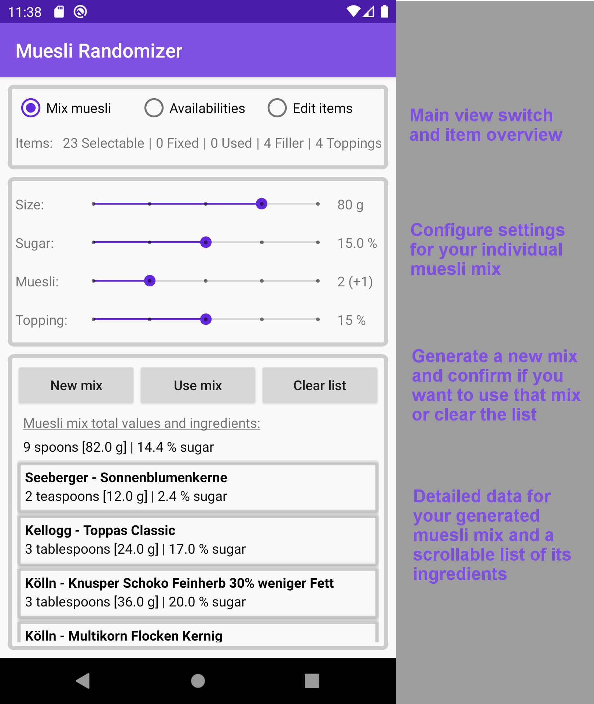
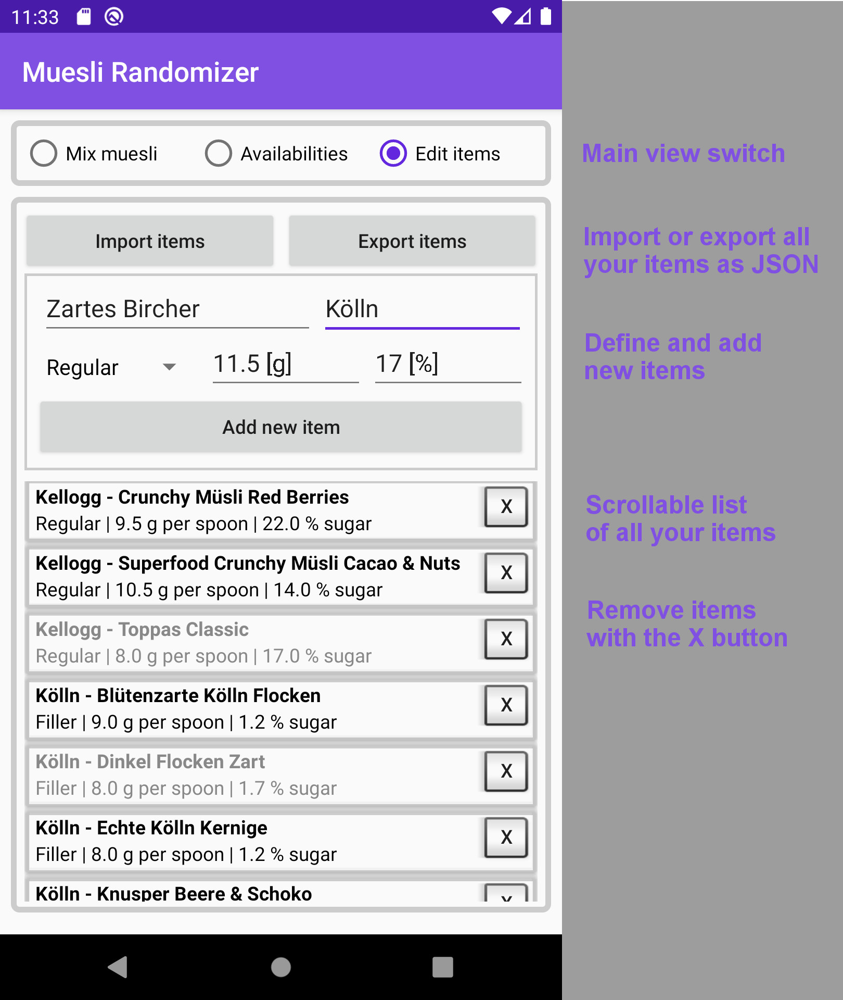

# Muesli Randomizer
 
App to generate randomized muesli mixes. Mueslis are picked from an exhaustible, recurring list based on given total size, sugar percentage and number of items. Results are displayed in convenient regular tablespoons.

An availibility multiplier (0x-3x) for each muesli can be defined via a separate view. Data import/export (JSON) and addition/removal of items can be done via another view. After muesli generation now empty items can conveniently be removed through an adjacent button.

New mixes are generated and evaluated until a close enough approximation to the given settings is found. To be able to better reach low sugar percentages a random filler muesli with a very low sugar amount is added as last item. When there aren't enough mueslis left in the list to get a valid mix the remnants are marked as fixed and the list is repopulated with the used items. Thus all mueslis are used evenly according to their availibility multipliers.

<table>
  <tr>
    <td>Regular muesli mixing view</td>
    <td>Availibility multiplier view</td>
    <td>Items editing view</td>
  </tr>
  <tr>
    <td></td>
    <td></td>
    <td></td>
  </tr>
</table>
